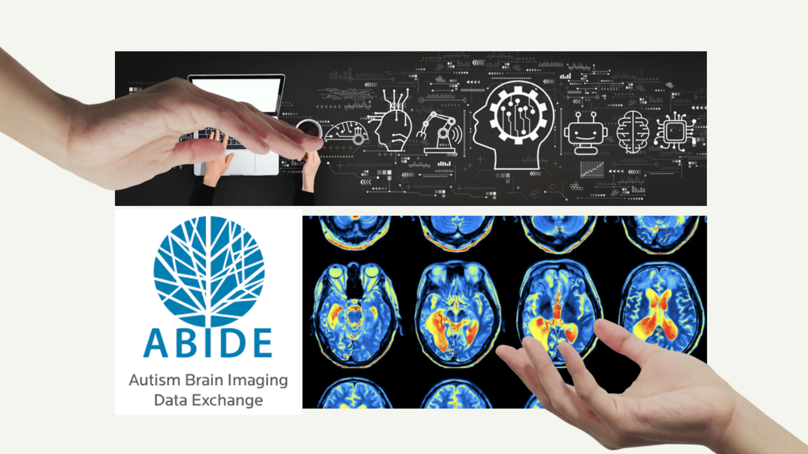
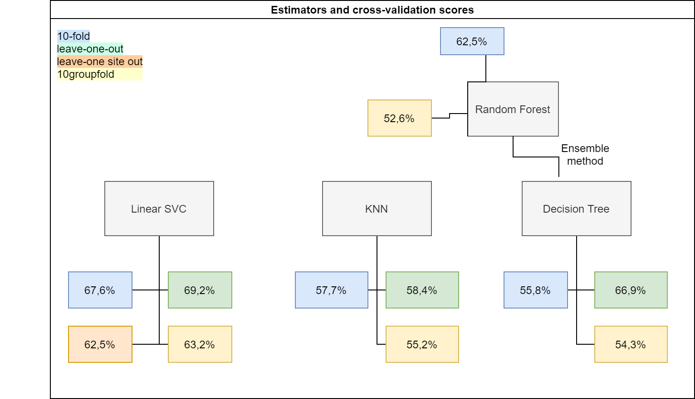

# Predicting Autism with fMRI Data
Contributors: Emily Chen, Andréanne Proulx, Mikkel Schöttner

This repository contains contributions from the [ABIDE team](https://github.com/orgs/brainhack-school2020/teams/abide-team) made during The BrainHack School 2020. This project uses resting state fMRI data from the ABIDE dataset to train machine learning models and is licensed under a Creative Commons Zero v1.0 Universal license. 

## Project Definition 

### Personal Backgrounds

#### Emily [(personal repository)](https://github.com/brainhack-school2020/emilyemchen-EEGML)
Hello! I am an (incoming) fourth year undergraduate student at McGill University studying computer science and urban health geography with a minor in cognitive science. I am a research assistant with Isabelle Arseneau-Bruneau in the Zatorre Lab and have been learning a lot about neuroscience research while (hopefully) lending some of my technical skills to Isabelle's PhD work exploring the effect of musical training on FFR. 

When joining the BrainHack School, I was looking forward in particular to working on a project at the intersection of neuroscience and CS because my previous classes rarely focused on the application of the abstract concepts we learned. Upon completion of the BrainHack School, I had the opportunity to learn from and collaborate with talented neuroscience researchers and participants, write a machine learning script using python and neuroscience data, and gain hands-on practice in reproducibility efforts and good project management. 

You can find me on GitHub at [emilyemchen](https://github.com/emilyemchen) and on Twitter at [@emilyemchen](https://twitter.com/emilyemchen).

#### Andréanne [(personal repository)](https://github.com/brainhack-school2020/anproulx-fMRI-autism)

Hi! I am an incoming master's student in Psychology at the University of Montreal. My background is in cognitive neuroscience and my career objective is to work on research projects aiming to discover new ways of characterizing the brain in its pathological states. At the moment, I am working with Sébastien Jacquemont and Pierre Bellec, and the focus of our research is on investigating the effect of genetic mutations on functional and structural brain phenotypes. More precisely, I have been working with resting-state functional connectivity measures in carrier populations with developmental disorders.

By joining the Brainhack School, I hoped to strengthen my computational skills and my knowledge in the applications of machine learning to the field of neuroimaging. Not only did I get to work on a machine learning problem specific to my field, but I also got to learn about useful tools such as GitHub. More importantly, I also met a community of brilliant/aware researchers and got to collaborate with other students, even across the world!

#### Mikkel [(personal repository)](https://github.com/brainhack-school2020/mschoettner_fMRI-ML)

[TO DO]

***

### Tools 

We expected to use the following tools, technologies, and libraries for this project: 

* Git
* GitHub
* Visual Studio Code
* Docker
* Jupyter Notebook
* HPC/Compute Canada
* Python libraries: `numpy`, `pandas`, `matplotlib`, `scikit-learn`, `nilearn`, `seaborn`, `pyplot`, `pyplot`
* `venv`

***

### Data 

The goal of this project was to compare different machine learning models and cross-validation methods and see how well each is able to predict autism from resting state fMRI data. We used the preprocessed open source [ABIDE database](http://fcon_1000.projects.nitrc.org/indi/abide/), which contains structural, functional, and phenotypic data of 539 individuals with autism and 573 typical controls from 20 different research sites.

***

### Deliverables 

By the end of The BrainHack School, we aimed to have the following: 
* `README.md` file
* `requirements.txt` file that outlines the packages needed to run the script
* Jupyter notebooks with code and explanations
* GitHub repository documenting project workflow
* Presentation showing project results

## Project Results

### Project Background 

Several studies have found an altered connectivity profile in the default mode network of subjects with Autism Spectrum Disorder, or ASD (Anderson, 2014). Based on these findings, resting state fMRI data have been used to predict autism by training a classifier on the multi-site ABIDE data set (Nielsen et al., 2013). This project's scientific aim is to replicate these findings and extends the literature by comparing the effects of differing cross-validation methods on various classification algorithms. 

### Becoming a Team 
The three of us joined forces when we realized that we shared many similar learning goals and interests. With such similar project ideas, we figured we would accomplish more working together by each taking on a different cross-validation methods to train various machine learning models. 

***

### Team Project Management

We all shared a common interest in making our project as reproducible as possible. This goal involved creating a transparent, collaborative workflow that could be tracked at any time by anyone. To achieve this objective, we utilized the many features that GitHub has to offer, all of which you can see in action at our shared repository [here](https://github.com/brainhack-school2020/abide-fmri).
* **Branches:** used to work simultaneously on our own parts and then push changes to the master branch
* **Pull requests:** created when making changes to the master branch
* **Issues:** used to communicate with each other and keep track of tasks
* **Tags:** used to keep issues organized
* **Milestones:** used to keep our main goals in mind (Week 4 presentation and final deliverable)
* **Projects:** used to track various aspects of our work 

***

### Standardized Data Preparation and Jupyter Notebooks

The data are processed in a standardized way using a Python script that prepares the data for the machine learning classifiers. Several Jupyter notebooks then implement different models and cross-validation techniques which are described in detail below.

***

### Tools, Technologies, and Libraries Learned

Many of these contribute to open science practices! 

* **Jupyter Notebook:** Write code in a virtual environment 
* **Visual Studio Code:** Edit files such as `README.md`
* **Python libraries:** `numpy`, `pandas`, `nilearn`, `matplotlib`, `plotly`, `seaborn`, `plotly`, `sklearn` (dimensionality reduction, test-train split, gridsearch, cross-validation methods, evaluate performance)
* **Git:** Track file changes
* **GitHub:** Organize team workflow and project
* **Machine learning:** Apply ML concepts and tools to the neuroimaging field
* **`venv`:** Make `requirement.txt` file for a reproducible virtual environment

***

### Deliverables

#### Deliverable 1: Jupyter notebooks (x3)

* ##### Leave-site-out cross-validation

[*`leave-site-out-cv_classifier.ipynb`*](https://github.com/brainhack-school2020/abide-fmri/blob/master/code/leave-site-out-cv_classifier.ipynb)

This notebook contains code to run a linear support vector classification to predict autism from resting state data. It uses leave-group-out cross-validation using site as the group variable. The results give a good estimate of how stable the model is. While for most of the sites the prediction works above chance level, for some, autism is predicted only at or even below chance level.

* ##### K-fold and leave-one-out cross-validation

[*`kfold-leave-one-out-cv_classifier.ipynb`*](https://github.com/brainhack-school2020/abide-fmri/blob/master/code/kfold-leave-one-out-cv_classifier.ipynb)

This notebook contains the code to run linear support vector classification, k-nearest neighbors, decision tree, and random forest algorithms on the ABIDE dataset. The models are trained and evaluated using k-fold and leave-one out cross-validation methods. We obtain accuracy scores that represent how skilled the model is at predicting the labels of unseen data.  Leave-one out cross validation gives more accurate predictions than k-fold cross validation. The accuracy values range from 55.8% to 69.2%.

* ##### Group k-folds cross-validation

[*`group-kfolds-cv_classifier.ipynb`*](https://github.com/brainhack-school2020/abide-fmri/blob/master/code/group-kfolds-cv_classifier.ipynb)

[DESCRIPTION TO DO]

##### What were the results? 

#### Deliverable 2: [`prepare_data.py`](https://github.com/brainhack-school2020/abide-fmri/blob/master/code/prepare_data.py) script

This script

* downloads the data
* extracts the time series of 64 regions of interest defined by the BASC brain atlas
* computes the correlations between time series for each participant
* uses a principal component analysis for dimensionality reduction

To fetch and prepare the data set you can call the `prepare_data.py` script like this:

`./prepare_data.py data_dir output_dir`

or alternatively:

`python prepare_data.py data_dir output_dir`

where
* `data_dir` is the directory where you want to save the data or have it already saved and
* `output_dir` is the directory where you want to store the outputs the script generates.

The notebooks also call the `prepare_data` function from the preparation script.

#### Deliverable 3: [`requirements.txt`](https://github.com/brainhack-school2020/abide-fmri/blob/master/requirements.txt) file 

This file increases reproducibility by helping to ensure that the scripts run correctly on any machine. To make sure that all scripts work correctly, you can create a virtual environment using pythons built-in library `venv`. To do this, follow these steps:

1. Clone repo and navigate to folder in a shell
2. Create a virtual environment in a folder of your choice: `python -m venv /path/to/folder`
3. Activate it (bash command, see [here](https://docs.python.org/3/library/venv.html) how to activate in different shells): `source /path/to/folder/bin/activate`
4. Install all necessary requirements from requirements file: `pip install -r requirements.txt`
5. Create kernel for jupyter notebooks: `ipython kernel install --user --name=abide-ml`
6. Open a jupyter notebook: `jupyter-notebook`, then click the notebook you want to run
7. Select different kernel by clicking *Kernel -> Change Kernel -> abide-ml*
8. Run the code!

#### Deliverable 4: Data visualizations (Week 3)

* [Emily's GitHub Repository](https://github.com/emilyemchen/bhs2020-dataviz)
    * [Age at Scan Distribution by ABIDE Test Site](https://emilyemchen.github.io/bhs2020-dataviz/abide_age.html)
    * [FIQ Score Distribution by ABIDE Test Site](https://emilyemchen.github.io/bhs2020-dataviz/abide_fiq.html)
    * [VIQ Score Distribution by ABIDE Test Site](https://emilyemchen.github.io/bhs2020-dataviz/abide_viq.html)
    * [PIQ Score Distribution by ABIDE Test Site](https://emilyemchen.github.io/bhs2020-dataviz/abide_piq.html)

* [Andréanne's GitHub Repository](https://github.com/brainhack-school2020/anproulx-fMRI-autism)
    * [Various data visualizations](https://chart-studio.plotly.com/~anproulx/2/data-visualization/#/)

* [Mikkel's GitHub Repository](https://github.com/brainhack-school2020/mschoettner_fMRI-ML)
    * [Age Distributions at Different Research Sites](https://mschoettner.github.io/brainhack_visualization/)

#### Deliverable 5: Presentation (Week 4)

The presentation slides can be viewed [here](https://www.canva.com/design/DAD-ByEQaXI/QLgHbYgnKd-xDWJXVnaGDA/view) on Canva, which is the platform we used to create the slides. A video of our presentation can be viewed on this project page. We presented our work to The BrainHack School on June 5, 2020 using the RISE integration in a Jupyter notebook, which can be found [here](https://github.com/brainhack-school2020/abide-fmri/tree/master/presentation). 

#### Deliverable 6: Overview of the project and results in the [`README.md`](https://github.com/brainhack-school2020/abide-fmri/blob/master/README.md) file

This `README.md` file contains the content that will be shown on the BrainHack School website [project page](https://school.brainhackmtl.org/project/). 

## Conclusion and Acknowledgement

First and foremost, we would like to thank our Weeks 3 and 4 peer clinic mentor and co-organizer of the Brainhack School, Pierre Bellec. A special thank you as well to our Week 2 mentors Désirée Lussier-Lévesque, Alexa Pichet-Binette, and Sebastian Urchs. 

Thank you also to The BrainHack School 2020 leaders and co-organizers Jean-Baptiste Poline, Tristan Glatard, and Benjamin de Leener, as well as the instructors and mentors Karim Jerbi, Elizabeth DuPre, Ross Markello, Peer Herholz, Samuel Guay, Valerie Hayot-Sasson, Greg Kiar, Jake Vogel, and Agâh Karakuzu. 

Thanks to all of you, this school was an amazing learning experience!

## References 

1. Choosing appropriate estimators with `scikit-learn` https://scikit-learn.org/stable/tutorial/machine_learning_map/

2. Benchmarking functional connectome-based predictive models for resting-state fMRI (for classification estimator inspiration) https://hal.inria.fr/hal-01824205

3. Getting the data using `nilearn.datasets.fetch` https://nilearn.github.io/modules/generated/nilearn.datasets.fetch_abide_pcp.html

4. Python Data Science Handbook GitHub and website https://github.com/jakevdp/PythonDataScienceHandbook

5. BrainHack School course materials and lectures https://github.com/neurodatascience/course-materials-2020

**Scientific articles:**

Anderson, J. S., Patel, V. B., Preedy, V. R., & Martin, C. R. (2014). Cortical underconnectivity hypothesis in autism: evidence from functional connectivity MRI. Comprehensive Guide to Autism, 1457, 1471.

Nielsen, J. A., Zielinski, B. A., Fletcher, P. T., Alexander, A. L., Lange, N., Bigler, E. D., ... & Anderson, J. S. (2013). Multisite functional connectivity MRI classification of autism: ABIDE results. Frontiers in Human Neuroscience, 7, 599.